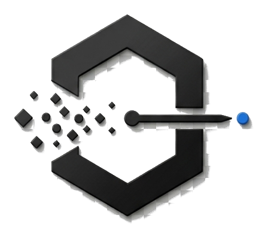
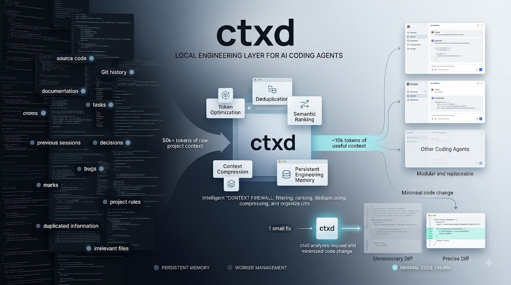

<div align="center">



# ctxd

**A context firewall for AI coding agents.**

Local-first engineering memory that gives Claude Code, Cursor and friends the
*minimum useful context* for a task — and explains every token it sent.

[](https://github.com/g0GobliN/ctxd/actions/workflows/ci.yml)
[](LICENSE)
[](https://nodejs.org)

</div>

---

<p align="center">
  
</p>

## The problem

You paste your repo into an AI agent. It gets 60,000 tokens, most of it
irrelevant, and still misses the one architectural rule that mattered. Next
session you explain the same project again. And again.

Meanwhile the agent "helpfully" reformats a file you asked it to change one
line in.

## What ctxd does

```
$ ctxd context --task "Fix Stripe webhook idempotency" --budget 10000

CONTEXT RECEIPT 87f27bbb

Candidate: 76,182 estimated tokens
Final:     4,547 estimated tokens
Estimated context avoided: 71,635

Included (16):
  ✓ docs/rules.md                       [P0]  reason: mandatory (P0)
  ✓ src/payment/webhook.ts              [P2]  reason: direct task relevance
  ✓ src/payment/idempotency.ts          [P2]  reason: direct task relevance
  ✓ memory/decision/idempotency-key.md  [P1]  reason: project memory (accepted_decision)
  …

Excluded (61):
  × src/camera/stream.ts           — no task relevance
  × docs/architecture-overview.md  — duplicate of docs/architecture.md
  × .ctxd/sessions/session-2.md    — low priority
```

76k tokens of candidate context became 4.5k — and every inclusion and exclusion
has a stated reason. Not compression: **selection you can audit**.

> **Storage is cheap. Model context is expensive.**
> Every token sent to a model should have a reason to exist.

## Principles

- **Local-first.** No cloud, no accounts, no telemetry. Your repository, memory
  and decisions never leave your machine.
- **Deterministic.** No embeddings, no LLM in the core. The same inputs produce
  byte-identical output, which is why it can be benchmarked.
- **Auditable.** Every context build produces a receipt. Nothing is included
  without a reason, and nothing is dropped silently.
- **Provider-independent.** Claude, Cursor and whatever comes next are
  *workers*. They are replaceable; your memory is not.
- **Honest.** Token counts are labelled estimates, never dollar figures.
  Unavailable signals read as zero rather than being invented.

## Install

Requires **Node.js 24+**.

```bash
npm install -g @ctxd/cli
ctxd doctor
```

`doctor` verifies Node, SQLite, FTS5, storage, config, the database, logging,
Git and offline capability. Every check actually runs — none reports success
without executing.

### From source

For contributors, or to run an unreleased change. Requires **pnpm** as well.

```bash
git clone https://github.com/g0GobliN/ctxd.git
cd ctxd
pnpm install
pnpm build:all      # core packages, then the interface bundle

node packages/cli/dist/index.js doctor
```

`pnpm build` alone builds the core packages; `build:all` also builds the
interface. React and Vite are build-time only — nothing remote is ever fetched
at runtime.

To put `ctxd` on your PATH from a source checkout:

```bash
# a) link it globally (needs "pnpm setup" once, to create the global bin dir)
pnpm --filter @ctxd/cli link --global

# b) or add an alias to your shell profile
alias ctxd="node /absolute/path/to/ctxd/packages/cli/dist/index.js"
```

On Windows, where `alias` does not exist, put a `ctxd.cmd` containing
`node "C:/path/to/ctxd/packages/cli/dist/index.js" %*` in a directory already
on `PATH`.

## Quickstart

```bash
# 1. Register your project. Detection reads real manifest files,
#    never guesses from directory names.
ctxd init --dir .

# 2. Build context for a task
ctxd context --task "Fix the webhook retry logic" --budget 10000

# 3. Record what a future session could not infer from the code
ctxd memory add --type DECISION --source accepted_decision \
  --title "Retry with exponential backoff" \
  --content "Fixed intervals caused a thundering herd under load."

# 4. Keep work across interruptions
ctxd session start --worker claude
ctxd checkpoint --next "Fix the 409 path then rerun tests"
ctxd resume
ctxd handoff --to cursor
```

## Connect an AI worker

```bash
claude mcp add ctxd -- ctxd mcp --dir /path/to/project
```

Claude Code and Cursor then share one project memory — neither owns it. The
agent asks ctxd for context instead of reading your whole repository, and
records what it learns.

Crucially: **a worker cannot overwrite what you told it.** Agent conclusions are
stored as `worker_statement` with visible confidence. If one contradicts a rule
you stated, the write is refused and the conflict reported.

## How it works

```
task ──► signals ──► candidates ──► dedup ──► rank ──► budget ──► receipt
                          ▲                              │
                     memory + git                  compression
```

| Stage | What it does |
|-------|--------------|
| **Signals** | Normalise the task into terms and phrases |
| **Candidates** | Walk the repo honouring `.gitignore`/`.ctxdignore`; never index secrets |
| **Retrieval** | Pull in relevant project memory and current Git state |
| **Dedup** | Drop exact and near-duplicate copies (shingles + Jaccard > 0.90) |
| **Rank** | Weighted signals: keyword, path, file type, priority, recency, token cost |
| **Budget** | Select the set that fits; compress what doesn't; **never truncate** |
| **Receipt** | Explain every inclusion and exclusion |

Two rules do most of the work:

- **Leftover budget is not a reason to send a file.** An item with no
  connection to the task is excluded even when there is room. This is why a
  10k budget often returns 4.5k.
- **Search decides what is relevant; it does not decide what is mandatory.**
  Every P0 rule is retrieved whether or not it shares vocabulary with the task.

Deep dive: [docs/context-engine.md](docs/context-engine.md).

## The other direction

The context firewall controls what goes *to* a worker. The **Diff Firewall**
inspects what comes back.

```
$ ctxd diff --task "Change the webhook retry limit from 3 to 5"

CHANGE RECEIPT 4f1c9a02

Changed:   3 files
Added:     241 lines      Removed: 118 lines

Semantic:        6 lines
Formatting-only: 312 lines (1 file)
Unrelated:       1 file
Dependency:      1 file

Assessment: NEEDS_REVIEW  (risk: high)
Change efficiency score: 0.41 — a focus measure, not a correctness score

Why:
  · SMALL TASK / LARGE CHANGE MISMATCH
      expected about 2 file(s) and 20 changed line(s); got 3 file(s),
      +241/−118 (6 semantic)
  · src/camera/stream.ts shares no vocabulary with the task
  · package.json added a dependency the task did not ask for
```

Six lines of real change inside 359 lines of diff — and it says which is which.

**It never edits, reverts or rejects anything.** A large diff is not wrong by
itself; sometimes the task needs one. The firewall makes the *shape* of a change
visible so a person can decide.

`ctxd verify` then runs the project's own checks — never reporting a check as
passed unless it actually ran. When one fails, it builds a **correction
context**: the failed command, the error, and the code it points at. Not the
original context. The worker already has that.

## See it

```bash
ctxd ui     # http://127.0.0.1:4317
```

A local interface over the same receipts: the context inspector showing why each
file was included or excluded, the change inspector, project memory, tasks and
Git state.

It binds loopback only, refuses a non-loopback `Host` or `Origin`, and requires
a local token for anything that writes. It is a viewer, not a second brain —
everything it shows is available from the CLI.

Deep dives: [docs/ui.md](docs/ui.md) · [docs/api.md](docs/api.md).

Deep dive: [docs/diff-firewall.md](docs/diff-firewall.md) ·
[docs/verification.md](docs/verification.md).

## Commands

| Command | Purpose |
|---------|---------|
| `ctxd doctor` | Verify the local environment |
| `ctxd status` | Version, storage, database, project, Git |
| `ctxd init` | Register and index a project |
| `ctxd context` | Build minimum useful context for a task |
| `ctxd diff` | Inspect a worker's changes before accepting them |
| `ctxd verify` | Run the project's own checks against those changes |
| `ctxd search` | Expand context incrementally |
| `ctxd stats` | What ctxd has kept out of the model's context |
| `ctxd efficiency` | The context reduction, on its own |
| `ctxd memory` | Record and search project knowledge |
| `ctxd decision` | Record and surface project decisions |
| `ctxd bug` | Record and surface previous bugs |
| `ctxd explain` | Attach a WHY note to a file or module |
| `ctxd task` | Track units of work |
| `ctxd session` | Track a working session |
| `ctxd checkpoint` | Record where the work stands |
| `ctxd handoff` | Everything another worker needs |
| `ctxd resume` | What was I doing? |
| `ctxd ui` | Serve the local API for the ctxd interface |
| `ctxd mcp` | Run the MCP server |

Every command supports `--help`.

## Project status

**Early but real.** Phases 1–10 of the [specification](docs/plan.md) are built,
tested and documented — 655 tests, including seven golden benchmarks that turn
77k–151k token fixture repositories into 2k–6k while keeping everything each
task needs, and three change benchmarks covering the output firewall.

| Phase | Status |
|-------|--------|
| 1 · Foundation | ✅ |
| 1.5 · Context engine | ✅ |
| 2 · Project intelligence | ✅ |
| 3 · Persistent memory | ✅ |
| 4 · Production context firewall | ✅ |
| 5 · MCP + worker integration | ✅ |
| 6 · Tasks, sessions, checkpoints, handoffs | ✅ |
| 7 · Verification + Diff Firewall | ✅ |
| 8 · Local API + web UI | ✅ |
| 9 · Optimisation + benchmarks | ✅ |
| 10 · Optional local AI | ✅ interfaces |

**2.0 — the graph control centre — is complete.** UI-0 through UI-12: the event
log and live stream, real worker state, the interactive graph home screen, the
activity stream, the Change Firewall panel, the token monitor, verification
freshness, cross-worker handoff, and the Tauri desktop shell. Eleven panels
ship, worker monitor and settings among them.

```bash
ctxd ui        # the interface in a browser
ctxd desktop   # the same interface in a native window
```

The desktop shell is verified on Windows 11 and not yet built on macOS or
Linux. There is no installer yet — see [desktop.md](docs/desktop.md).

Nothing in this repository calls a network service or an AI model.

APIs may change before 1.0.

## Documentation

| Document | Contents |
|----------|----------|
| [architecture.md](docs/architecture.md) | Packages, dependencies, schema |
| [storage.md](docs/storage.md) | Where everything lives, and what is never stored |
| [cli.md](docs/cli.md) | Every command, with exit codes |
| [context-engine.md](docs/context-engine.md) | Ranking, selection, compression, receipts |
| [diff-firewall.md](docs/diff-firewall.md) | Change surface, over-edit detection, Change Receipts |
| [verification.md](docs/verification.md) | Verification, architecture drift, correction context |
| [memory.md](docs/memory.md) | Memory types, authority order, FTS5 search |
| [work.md](docs/work.md) | Tasks, sessions, checkpoints, handoffs |
| [api.md](docs/api.md) | The local HTTP API and its security model |
| [ui.md](docs/ui.md) | The interface, how it is served, and its dependencies |
| [desktop.md](docs/desktop.md) | The Tauri shell, its security model, and how to build it |
| [mcp.md](docs/mcp.md) | The MCP tool surface |
| [workers.md](docs/workers.md) | Worker identity as a claim, connection states, the registry |
| [events.md](docs/events.md) | The event log and the live stream |
| [benchmarks.md](docs/benchmarks.md) | Benchmark scenarios, results, performance targets |
| [local-ai.md](docs/local-ai.md) | The optional-AI interfaces and the offline guarantee |
| [development.md](docs/development.md) | Building, testing, conventions |
| [security.md](docs/security.md) | Threat model, secrets, execution, the local API |
| [roadmap.md](docs/roadmap.md) | Built, not built, and never |
| [plan.md](docs/plan.md) | The full specification |

## Contributing

Contributions are very welcome — especially benchmark scenarios, which is how
retrieval quality gets measured rather than argued about.

Start with [CONTRIBUTING.md](CONTRIBUTING.md).

```bash
pnpm install && pnpm build && pnpm test
```

By participating you agree to the [Code of Conduct](CODE_OF_CONDUCT.md).
Security issues: see [SECURITY.md](SECURITY.md).

## Licence

[MIT](LICENSE) © the ctxd authors.
